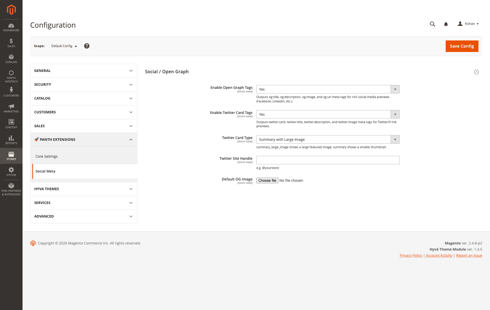

<!-- SEO Meta -->
<!--
  Title: Panth Social Meta — Open Graph + Twitter Card Tags for Magento 2 (Hyva + Luma)
  Description: Clean, single-emission Open Graph and Twitter Card meta tags for Magento 2. Five store-scoped admin toggles (OG enable, Twitter enable, Twitter card type, Twitter site handle, default OG image), automatic removal of Magento/Hyva native og:* blocks so no duplicates ever ship, escape-safe rendering that keeps `@` handles and URLs readable in view-source, product:availability / product:brand / og:locale output, Facebook-Shop-compatible price tags on PDP, and theme-agnostic head rendering — identical output on Hyva and Luma with zero template overrides.
  Keywords: magento 2 open graph, magento 2 twitter card, magento og tags, magento social meta, magento facebook preview, magento twitter preview, hyva open graph, luma open graph, magento og:image, magento product availability meta, panth social meta
  Author: Kishan Savaliya (Panth Infotech)
-->

# Panth Social Meta — Open Graph + Twitter Card Tags for Magento 2 (Hyva + Luma)

[](https://magento.com)
[](https://php.net)
[](https://hyva.io)
[]()
[](https://packagist.org/packages/mage2kishan/module-social-meta)
[](https://www.upwork.com/freelancers/~016dd1767321100e21)
[](https://kishansavaliya.com)
[](https://kishansavaliya.com/get-quote)

> **Out of the box Magento emits five og:* tags on product pages and zero on categories or CMS pages — and on Hyva the core `product/view/opengraph/general.phtml` template happily duplicates whatever a theme, a third-party SEO module, or a manual layout snippet has already added.** The visible result is a Facebook preview that picks the wrong image, a Twitter card that omits the `@handle`, and view-source output with entity-encoded `&#x40;` where you wrote `@yourstore`. **Panth Social Meta** fixes the stack end-to-end: one resolver computes `og:*` and `twitter:*` from the current entity (product / category / CMS) with progressive image / title / description fallbacks, an observer on `layout_generate_blocks_after` strips Magento and Hyva's native OG blocks so duplicates can never render, and the templates use `escapeUrl()` for URL-valued attributes and `escapeHtml()` (ENT_QUOTES | ENT_HTML5) — not Zend Escaper — for text-valued ones so `@yourstore` stays readable while still being XSS-safe. Five store-scoped admin fields cover the entire configuration surface. Zero JS, zero theme overrides, identical output on Hyva and Luma.

Product pages additionally emit `product:price:amount`, `product:price:currency`, `product:availability` (derived from `$product->isSalable()` → `instock` | `oos`) and `product:brand` (from the `manufacturer` attribute) so Facebook Shop and every major product-feed ingester pick up pricing and stock state without a separate feed plugin. `og:locale` tracks each store's `general/locale/code`, so a UK store view ships `en_GB` while the US store view ships `en_US` from the same codebase.

---

## Need Custom Magento 2 Development?

<p align="center">
  <a href="https://kishansavaliya.com/get-quote">
    
  </a>
</p>

<table>
<tr>
<td width="50%" align="center">

### Kishan Savaliya
**Top Rated Plus on Upwork**

[](https://www.upwork.com/freelancers/~016dd1767321100e21)

</td>
<td width="50%" align="center">

### Panth Infotech Agency

[](https://www.upwork.com/agencies/1881421506131960778/)

</td>
</tr>
</table>

---

## Table of Contents

- [Preview](#preview)
- [Features](#features)
- [How It Works](#how-it-works)
- [Compatibility](#compatibility)
- [Installation](#installation)
- [Verify](#verify)
- [Configuration](#configuration)
- [Storefront Rendering](#storefront-rendering)
- [Testing Your Social Tags](#testing-your-social-tags)
- [Troubleshooting](#troubleshooting)
- [Support](#support)

---

## Preview

### Admin

**System configuration** — **Stores → Configuration → Panth Extensions → Social Meta**. Five store-scoped fields: Enable Open Graph Tags, Enable Twitter Card Tags, Twitter Card Type (`summary` | `summary_large_image`), Twitter Site Handle (`@yourstore`), and Default OG Image (uploaded under `media/panth_seo/og/`). Every field is `[store view]`-scoped so a multi-store install can ship a different handle, card type and fallback image per storefront.



---

## Features

| Feature | Description |
|---|---|
| **Single-emission OG + Twitter** | `Observer\Social\RemoveNativeOgObserver` runs on `layout_generate_blocks_after` and unsets every native OG block it can find — the four well-known names (`opengraph.general`, `opengraph.product`, `opengraph.category`, `opengraph.cms`) plus anything matching `opengraph` (substring) or `og.` (prefix). The module's own blocks (prefixed `panth_social_meta.`) are explicitly skipped. Net result: exactly one `og:title`, one `og:image`, one `og:url` per page — never a duplicate pair from a theme + module collision. |
| **Disable = silence** | When `og_enabled = No`, the observer still runs so Magento core's `product/view/opengraph/general.phtml` (which ships 5 `og:*` tags on every PDP) does not silently leak through. Flipping the toggle off means zero `og:*` on the storefront, which is what the admin label actually implies. |
| **Entity-aware resolver** | `Model\Social\OpenGraphResolver::resolve()` detects the current entity via `current_product` / `current_category` in the Magento registry. Products get `og:type=product` plus `product:price:*`, `product:availability`, `product:brand`. Categories and CMS pages get `og:type=website`. Title / description / image / URL each have their own progressive fallback chain so the tags never blank out. |
| **Title fallback chain** | Product: `meta_title` → `name`. Category: `meta_title` → `name`. CMS / other: `PageConfig->getTitle()` (set by the CMS controller from the page's own meta_title) → store name. |
| **Description fallback chain** | Product: `meta_description` → `short_description`. Category: `meta_description` → `description`. CMS / other: `PageConfig->getDescription()` → `design/head/default_description`. Every description is truncated at 200 characters using a single-character ellipsis `…` (not three dots) so Facebook's preview card renders cleanly. |
| **Image fallback chain** | Product image → category image → first in-stock product image in that category → admin-configured Default OG Image (`panth_social_meta/social/default_og_image`, stored under `media/panth_seo/og/`) → store logo (`design/header/logo_src`) → Magento's product placeholder. Never blank unless the store has no logo and no placeholder either. |
| **URL canonicalisation** | `og:url` uses the entity's own URL model (`$product->getProductUrl(false)` / `$category->getUrl()`), query string stripped. CMS / other pages use `$store->getCurrentUrl(false)` with `?` and `#` trimmed. Rendered through `escapeUrl()` so `:` and `/` stay intact in view-source. |
| **`og:site_name` prefers brand over store label** | Reads `general/store_information/name` first, falling back to `$store->getName()`. So a merchant with "Agritrend UK" in Store Information ships that as the site name even if the Magento store view label is still the factory default "Default Store View". |
| **`og:locale` per store view** | Reads `general/locale/code` at store scope and emits it verbatim (`en_US`, `en_GB`, `fr_FR`, …). Multi-store installs get correct per-region `og:locale` with no admin work. |
| **Product stock state** | `product:availability` is derived from `$product->isSalable()` — `instock` when salable, `oos` when not. Flipping stock status in the admin immediately changes the emitted tag on the next uncached render, so Facebook Shop and catalog ingesters see accurate stock state. |
| **Product brand** | `product:brand` reads the `manufacturer` attribute's dropdown label via `getAttributeText('manufacturer')`. Optional — only emitted when the attribute is set. |
| **Product price tags** | `product:price:amount` and `product:price:currency` on PDP when the final price is positive. Price is formatted with exactly two decimals and a period separator, matching the OpenGraph product vocab. |
| **Twitter Card wraps OG** | `TwitterCardResolver` reuses the OG output — `twitter:title`, `twitter:description`, `twitter:image` all mirror their `og:*` counterparts, `twitter:card` is the admin-configured type, and `twitter:site` carries the configured handle (emitted only when non-empty). Turn OG off and Twitter auto-switches off; turn OG on and Twitter on independently. |
| **Escape-safe rendering** | URL-valued attributes (`og:url`, `og:image`, `og:image:secure_url`, `og:video`, `og:audio`, `twitter:image`, `twitter:image:src`, `twitter:player`) go through `escapeUrl()` which preserves `:` and `/`. Text-valued attributes go through `escapeHtml()` which uses `htmlspecialchars()` with `ENT_QUOTES | ENT_HTML5` — escapes the five characters that matter inside a double-quoted attribute (`<`, `>`, `&`, `"`, `'`) without mangling `@`, `&`-free ampersand-like text, or other printable ASCII. This is why `@yourstore` lands as `content="@yourstore"` in view-source instead of the over-escaped `content="&#x40;yourstore"` you get with Magento's default `escapeHtmlAttr()` (which runs Zend\Escaper). |
| **EAV OG attributes on product + category** | `Setup\Patch\Data\AddOgAttributes` installs `og_title`, `og_description`, `og_image` on every product and category attribute set, under the "Search Engine Optimization" fieldset. Populate them per-entity when you want to override what the meta_title / meta_description fallback would emit. |
| **Theme-agnostic head rendering** | `view/frontend/layout/default.xml` attaches both head blocks to `head.additional`. Templates are plain PHP `<meta>` output — no Alpine directives, no RequireJS, no `x-magento-init`. Identical output on Hyva, Luma, Breeze, custom themes. |
| **Fully cacheable** | Both head blocks declare `cacheable="true"`. Output ends up in full-page cache alongside the rest of `<head>` and costs nothing per-request after the first uncached render. The observer fires only during layout generation, not on cached hits. |

---

## How It Works

Four cooperating pieces, one request:

1. **`Observer\Social\RemoveNativeOgObserver`** runs on `layout_generate_blocks_after` in the frontend area. Before any block is rendered it walks the layout tree twice — once by well-known block names (`opengraph.general`, `opengraph.product`, `opengraph.category`, `opengraph.cms`), once by pattern (`opengraph` substring, `og.` prefix) — and `unsetElement()`s each match. This module's own blocks start with `panth_social_meta.` and are skipped by name, so only native Magento / Hyva / third-party OG blocks disappear. The observer runs unconditionally: when a merchant disables the module's OG output they expect zero `og:*` on the storefront, not Magento core's 5-tag native template filling the vacuum.
2. **`Model\Social\OpenGraphResolver::resolve()`** is the read path. It detects the current entity from the Magento registry, walks the title / description / image / URL fallback chains, pulls `og:site_name` from `general/store_information/name`, pulls `og:locale` from `general/locale/code`, and — when the entity is a product — adds `product:price:amount`, `product:price:currency`, `product:availability` (from `isSalable()`) and `product:brand` (from the `manufacturer` attribute). Returns a flat `['og:property' => 'value']` array with empty values filtered out.
3. **`Model\Social\TwitterCardResolver::resolve()`** wraps the OG result. `twitter:title` / `twitter:description` / `twitter:image` mirror the OG equivalents so the two preview cards always agree. `twitter:card` is the admin-configured type, `twitter:site` is the configured handle (omitted when empty). Returns an empty array if the OG resolver returns empty — so disabling OG silently disables Twitter too.
4. **The two phtml templates** (`view/frontend/templates/head/opengraph.phtml` + `.../twittercard.phtml`) iterate the resolved array and emit one `<meta>` tag per entry. URL-valued attribute names (hardcoded allowlist) go through `$escaper->escapeUrl()`, everything else goes through `$escaper->escapeHtml()`. The property / name value itself is always escaped with `escapeHtml()` because the allowlist is fixed to ASCII. When the resolver returns empty (module disabled, no entity, etc.) the template early-returns and writes nothing.

The EAV patch (`Setup\Patch\Data\AddOgAttributes`) is a one-shot install that runs during `setup:upgrade` — it adds `og_title`, `og_description`, `og_image` to every product and category attribute set, under the "Search Engine Optimization" group. The attributes are read by the resolver via the standard `getData()` path when set.

---

## Compatibility

| Requirement | Supported |
|---|---|
| Magento Open Source | 2.4.4, 2.4.5, 2.4.6, 2.4.7, 2.4.8 |
| Adobe Commerce | 2.4.4 — 2.4.8 |
| PHP | 8.1, 8.2, 8.3, 8.4 |
| Hyva Theme | 1.0+ (fully compatible — no theme overrides) |
| Luma Theme | Native support |
| Panth Core | ^1.0 (installed automatically) |

---

## Installation

```bash
composer require mage2kishan/module-social-meta
bin/magento module:enable Panth_Core Panth_SocialMeta
bin/magento setup:upgrade
bin/magento setup:di:compile
bin/magento cache:flush
```

---

## Verify

```bash
bin/magento module:status Panth_SocialMeta
# Module is enabled

# Any product page should emit exactly one og:* block + one twitter:* block
curl -ks https://hyva.test/tiber-t-shirt.html | grep -oE '<meta (property|name)="(og|twitter|product):[^"]+"[^>]*>'
# <meta property="og:type" content="product" />
# <meta property="og:title" content="Tiber T-Shirt" />
# <meta property="og:description" content="Soft combed cotton, straight hem, made for everyday wear." />
# <meta property="og:image" content="https://hyva.test/media/catalog/product/t/i/tiber-t-shirt.jpg" />
# <meta property="og:url" content="https://hyva.test/tiber-t-shirt.html" />
# <meta property="og:site_name" content="Agritrend UK" />
# <meta property="og:locale" content="en_US" />
# <meta property="product:price:amount" content="29.00" />
# <meta property="product:price:currency" content="USD" />
# <meta property="product:availability" content="instock" />
# <meta property="product:brand" content="Tiber Clothing" />
# <meta name="twitter:card" content="summary_large_image" />
# <meta name="twitter:title" content="Tiber T-Shirt" />
# <meta name="twitter:description" content="Soft combed cotton, straight hem, made for everyday wear." />
# <meta name="twitter:image" content="https://hyva.test/media/catalog/product/t/i/tiber-t-shirt.jpg" />
# <meta name="twitter:site" content="@agritrend" />

# Category page — same flow minus the product:* block
curl -ks https://hyva.test/men/tops-men.html | grep -oE '<meta property="og:[^"]+"[^>]*>'
# <meta property="og:type" content="website" />
# <meta property="og:title" content="Men's Tops" />
# <meta property="og:description" content="Everyday tees, long-sleeve, fleece and performance fabrics." />
# <meta property="og:image" content="https://hyva.test/media/catalog/category/men-tops-hero.jpg" />
# <meta property="og:url" content="https://hyva.test/men/tops-men.html" />
# <meta property="og:site_name" content="Agritrend UK" />
# <meta property="og:locale" content="en_US" />

# Luma store view — identical output from a different domain
curl -ks https://luma.test/tiber-t-shirt.html | grep -oE '<meta property="og:url"[^>]+>'
# <meta property="og:url" content="https://luma.test/tiber-t-shirt.html" />

# Confirm no duplicates — this count should always be 1 per property per page
curl -ks https://hyva.test/tiber-t-shirt.html | grep -c '<meta property="og:title"'
# 1
```

Visit **Stores → Configuration → Panth Extensions → Social Meta** to see the admin panel.

---

## Configuration

Navigate to **Stores → Configuration → Panth Extensions → Social Meta**.

| Setting | Path | Default | What it controls |
|---|---|---|---|
| **Enable Open Graph Tags** | `panth_social_meta/social/og_enabled` | Yes | Master switch for `og:*`. When No the resolver returns empty, the OpenGraph template writes nothing, **and** the observer still strips Magento's native OG blocks — so the page ships with zero `og:*` instead of falling back to core's 5-tag native template. |
| **Enable Twitter Card Tags** | `panth_social_meta/social/twitter_enabled` | Yes | Master switch for `twitter:*`. Independent of OG — you can ship OG only (disable Twitter), Twitter only (disable OG), both, or neither. |
| **Twitter Card Type** | `panth_social_meta/social/twitter_card_type` | `summary_large_image` | `summary_large_image` shows a large featured image in Twitter/X preview cards; `summary` shows a smaller square thumbnail. Source model: `Panth\SocialMeta\Model\Config\Source\TwitterCardType`. |
| **Twitter Site Handle** | `panth_social_meta/social/twitter_site_handle` | *(empty)* | The `@yourstore` handle emitted as `twitter:site`. When empty, the tag is omitted entirely — not emitted as an empty attribute. Plain-text — the template escapes via `escapeHtml()` so the `@` sign stays readable in view-source. |
| **Default OG Image** | `panth_social_meta/social/default_og_image` | *(empty)* | Image uploaded under `media/panth_seo/og/`. Used as the penultimate fallback in the image chain — after product image, category image and first-product-in-category, before the store logo and Magento placeholder. Recommended size: 1200 × 630 (Facebook / Twitter `summary_large_image` aspect ratio). |

Every field is `[store view]`-scoped. Ship a different `twitter_site_handle`, card type and Default OG Image per storefront to match each brand's social presence.

After saving, flush the `config` and `full_page` caches — the observer output is baked into FPC so a cached page keeps whichever configuration was active when it was cached:

```bash
bin/magento cache:flush config full_page
```

---

## Storefront Rendering

`view/frontend/layout/default.xml` attaches both head blocks to `head.additional`:

```xml
<referenceBlock name="head.additional">
  <block class="Panth\SocialMeta\Block\Head\OpenGraph"
         name="panth_social_meta.opengraph"
         template="Panth_SocialMeta::head/opengraph.phtml"
         cacheable="true">
    <arguments>
      <argument name="view_model" xsi:type="object">Panth\SocialMeta\ViewModel\OpenGraph</argument>
    </arguments>
  </block>
  <block class="Panth\SocialMeta\Block\Head\TwitterCard"
         name="panth_social_meta.twittercard"
         template="Panth_SocialMeta::head/twittercard.phtml"
         cacheable="true">
    <arguments>
      <argument name="view_model" xsi:type="object">Panth\SocialMeta\ViewModel\TwitterCard</argument>
    </arguments>
  </block>
</referenceBlock>
```

### Product page (PDP)

```html
<meta property="og:type" content="product" />
<meta property="og:title" content="Compete Track Tote" />
<meta property="og:description" content="Lightweight tote for gym and track — waterproof lining, expandable side pocket." />
<meta property="og:image" content="https://hyva.test/media/catalog/product/w/b/wb04-black-0.jpg" />
<meta property="og:url" content="https://hyva.test/compete-track-tote.html" />
<meta property="og:site_name" content="Agritrend UK" />
<meta property="og:locale" content="en_US" />
<meta property="product:price:amount" content="32.75" />
<meta property="product:price:currency" content="USD" />
<meta property="product:availability" content="instock" />
<meta property="product:brand" content="Compete Sports" />
<meta name="twitter:card" content="summary_large_image" />
<meta name="twitter:title" content="Compete Track Tote" />
<meta name="twitter:description" content="Lightweight tote for gym and track — waterproof lining, expandable side pocket." />
<meta name="twitter:image" content="https://hyva.test/media/catalog/product/w/b/wb04-black-0.jpg" />
<meta name="twitter:site" content="@agritrend" />
```

### Category page

```html
<meta property="og:type" content="website" />
<meta property="og:title" content="Men's Tops" />
<meta property="og:description" content="Every seasonal men's top in one place — tees, hoodies, performance fabrics." />
<meta property="og:image" content="https://hyva.test/media/catalog/category/men-tops.jpg" />
<meta property="og:url" content="https://hyva.test/men/tops-men.html" />
<meta property="og:site_name" content="Agritrend UK" />
<meta property="og:locale" content="en_US" />
```

### CMS page (About Us, Contact, Shipping Policy, …)

```html
<meta property="og:type" content="website" />
<meta property="og:title" content="About Us" />
<meta property="og:description" content="Independent UK running retailer shipping across Europe from our Bristol warehouse." />
<meta property="og:image" content="https://hyva.test/media/panth_seo/og/default-og-1200x630.jpg" />
<meta property="og:url" content="https://hyva.test/about-us" />
<meta property="og:site_name" content="Agritrend UK" />
<meta property="og:locale" content="en_US" />
```

### Luma store view — identical resolver output, different host

```html
<meta property="og:url" content="https://luma.test/compete-track-tote.html" />
<meta property="og:site_name" content="Agritrend UK Outlet" />
<meta property="og:locale" content="en_GB" />
```

Because the resolver is driven entirely by store-scope config (`general/locale/code`, `general/store_information/name`, `panth_social_meta/social/*`) and the registry-detected entity, two store views on the same install produce correct-per-store output without any per-store layout XML. The EAV fallback (`og_title` / `og_description` / `og_image`) is also store-scoped via the standard ScopedAttributeInterface.

### What **disable** looks like

When both master switches are off, the page ships zero social meta — not a fallback to Magento core's native OG template:

```bash
curl -ks https://hyva.test/tiber-t-shirt.html | grep -c '<meta property="og:'
# 0
curl -ks https://hyva.test/tiber-t-shirt.html | grep -c '<meta name="twitter:'
# 0
```

---

## Testing Your Social Tags

A working setup requires the tags to be (a) present, (b) unique (one per property per page), (c) rendered with readable values (URLs not entity-encoded, `@` handles not over-escaped) and (d) preview-correct in the scraper tools. Validate all four.

### Official preview validators

The authoritative tools — paste any URL from the storefront:

- **[Facebook Sharing Debugger](https://developers.facebook.com/tools/debug/)** — scrapes the URL, shows the exact `og:*` values Facebook ingested, and lets you "Scrape Again" to force a cache refresh after deploying changes.
- **[Twitter/X Card Validator](https://cards-dev.twitter.com/validator)** (now rolled into [X's developer portal](https://developer.x.com/)) — renders the exact card the Twitter/X timeline will show, surfaces missing / broken tags.
- **[LinkedIn Post Inspector](https://www.linkedin.com/post-inspector/)** — inspects OG tags for LinkedIn previews, with a "Force re-scrape" control.
- **[opengraph.xyz](https://www.opengraph.xyz/)** — multi-platform preview (Facebook, Twitter/X, LinkedIn, WhatsApp, Slack, Discord, iMessage) from a single URL paste.

### In-browser spot check

Open any storefront URL and run in DevTools console:

```js
// Enumerate every social meta tag on the page
[...document.querySelectorAll('meta[property^="og:"], meta[property^="product:"], meta[name^="twitter:"]')]
  .map(m => `${m.getAttribute('property') || m.getAttribute('name')} → ${m.content}`)

// Duplicate detection — any count > 1 is a bug
const names = [...document.querySelectorAll('meta[property], meta[name]')]
  .map(m => m.getAttribute('property') || m.getAttribute('name'))
  .filter(n => n.startsWith('og:') || n.startsWith('twitter:') || n.startsWith('product:'));
const dupes = names.filter((n, i) => names.indexOf(n) !== i);
console.log('Duplicates:', dupes.length ? dupes : 'none ✓');
```

### CI smoke test

A minimal curl-based test you can wire into deploy:

```bash
for url in / /tiber-t-shirt.html /men/tops-men.html /about-us; do
  og=$(curl -ks "https://hyva.test${url}" | grep -c '<meta property="og:')
  tw=$(curl -ks "https://hyva.test${url}" | grep -c '<meta name="twitter:')
  dup=$(curl -ks "https://hyva.test${url}" | grep -c '<meta property="og:title"')
  if [ "$og" -lt 5 ] || [ "$dup" -ne 1 ]; then
    echo "FAIL  ${url}  og=${og}  og:title×${dup}  twitter=${tw}"; exit 1
  fi
  echo "OK    ${url}  og=${og}  twitter=${tw}"
done
```

Run on both Hyva and Luma hosts after every deploy that touches social meta, theme layout, or the RemoveNativeOgObserver.

### Confirm the observer is stripping native blocks

```bash
# With og_enabled=No, Magento core's product/view/opengraph/general.phtml would normally ship 5 native og:* tags on a PDP
bin/magento config:set panth_social_meta/social/og_enabled 0
bin/magento cache:flush config full_page
curl -ks https://hyva.test/tiber-t-shirt.html | grep -c '<meta property="og:'
# 0  ← observer stripped the native blocks; no silent fallback
bin/magento config:set panth_social_meta/social/og_enabled 1
bin/magento cache:flush config full_page
```

If this returns anything other than `0` when disabled, either a third-party module is re-adding an OG block under a name that doesn't match the `opengraph` / `og.` patterns, or FPC is still serving a cache entry from before the flush. Hard-flush with `bin/magento cache:clean` and re-test.

---

## Troubleshooting

### No `og:*` or `twitter:*` tags on the storefront

Three things to check, in order:

1. **Master switches** — *Stores → Configuration → Panth Extensions → Social Meta → Enable Open Graph Tags / Enable Twitter Card Tags = Yes* at the current store scope. When No, the resolver returns empty and the template writes nothing. Flush `config` + `full_page` caches after flipping.
2. **FPC cache** — the page was cached before the config change. Run `bin/magento cache:flush config full_page` and re-test. The resolver is only invoked on uncached renders.
3. **Theme overriding `head.additional`** — a custom theme's layout XML can null out the `head.additional` container. Search your theme package for `<referenceBlock name="head.additional" remove="true"/>` and remove it. The same layout XML is what hosts Magento's native OG tags, so removing it breaks those too.

### `og:title` or `og:image` rendering twice

A third-party SEO / Hyva module is re-adding an OG block under a name that doesn't match the observer's patterns. Check with:

```bash
curl -ks https://hyva.test/tiber-t-shirt.html | grep -oE '<meta property="og:title"[^>]*>' | sort -u
# Should show exactly one line
```

If two different lines appear, identify the offending module (`bin/magento module:status` + `grep -r "og:title" vendor/<vendor>/`) and either (a) open an issue with the offending module to adopt a predictable block name (`opengraph.*` or `og.*`), or (b) add its block name to `Observer\Social\RemoveNativeOgObserver::NATIVE_OG_BLOCKS` and PR upstream.

### `twitter:site` shows `&#x40;yourstore` instead of `@yourstore`

Your theme is shipping an override of `view/frontend/templates/head/twittercard.phtml` that uses `$escaper->escapeHtmlAttr()` instead of `$escaper->escapeHtml()`. Magento's `escapeHtmlAttr()` runs Zend\Escaper which aggressively encodes every non-ASCII-safe byte, so the `@` sign becomes `&#x40;`. Social scrapers decode entities so the handle still **works**, but it looks wrong in view-source and some linters flag it. Fix: remove the theme override, or mirror the module's escape strategy (`escapeUrl()` for URL-valued names, `escapeHtml()` for everything else).

### `product:availability` always `instock` even for out-of-stock products

The resolver reads `$product->isSalable()`. If this returns true for an out-of-stock product, you have a stock configuration issue, not a social meta one — check *Stores → Configuration → Catalog → Inventory → Stock Options → Display Out of Stock Products* and the product's own stock status. Confirm by loading the product in a bin/magento script:

```bash
php -r '
require __DIR__ . "/app/bootstrap.php";
$bs = \Magento\Framework\App\Bootstrap::create(BP, []);
$om = $bs->getObjectManager();
$om->get(\Magento\Framework\App\State::class)->setAreaCode("frontend");
$p = $om->create(\Magento\Catalog\Model\ProductRepository::class)->get("tiber-t-shirt");
var_dump($p->isSalable());
'
```

If this prints `true` but the frontend shows Out of Stock, the resolver is reporting `isSalable()` correctly and the storefront display is driven by stock inventory — bring the two in line via the product's Stock Status.

### `og:site_name` = "Default Store View"

Nothing has been set in *Stores → Configuration → General → Store Information → Store Name*. The resolver prefers that value (the merchant-facing brand name) and only falls back to the Magento store view label when it's empty. Set the Store Name per store view and re-flush caches.

### `og:image` returning an absolute URL for the placeholder even though a Default OG Image is uploaded

The uploaded file must live under `media/panth_seo/og/` — the backend model `Magento\Config\Model\Config\Backend\Image` stores it there automatically when uploaded via the admin form. If you moved the file by hand, move it back or re-upload via the admin. The resolver also rejects values containing `..`, backslashes, leading `/`, or null bytes as a path-traversal guard.

### Tests pass but Facebook's preview still shows the old image

Facebook aggressively caches OG data. Open the [Sharing Debugger](https://developers.facebook.com/tools/debug/), paste the URL, and click **Scrape Again**. Twitter/X and LinkedIn have equivalent controls. The resolver does not cache OG data itself — the stale preview is server-side on the scraper, not the store.

---

## Support

- **Agency:** [Panth Infotech on Upwork](https://www.upwork.com/agencies/1881421506131960778/)
- **Direct:** [kishansavaliya.com](https://kishansavaliya.com) — [Get a free quote](https://kishansavaliya.com/get-quote)
