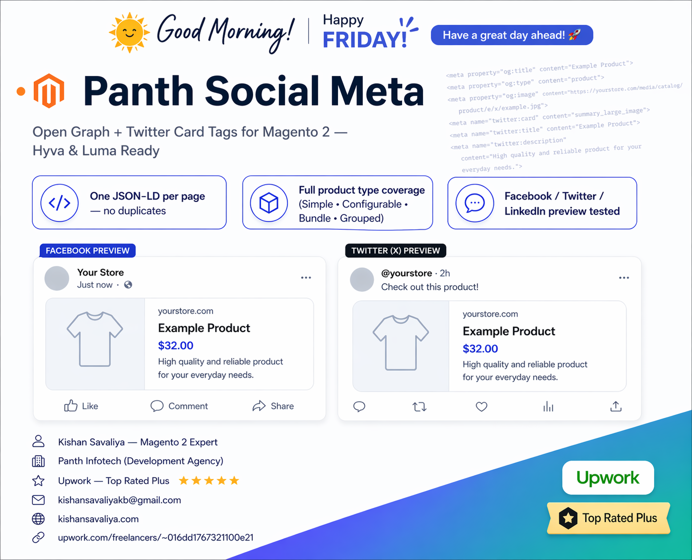
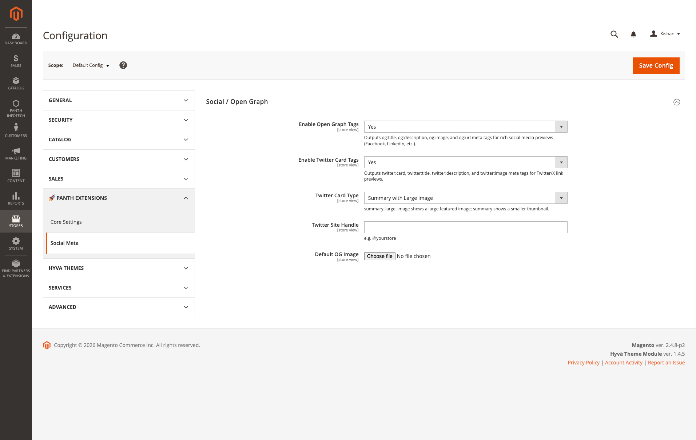

<!-- SEO Meta -->
<!--
  Title: Magento 2 Open Graph and Twitter Card Extension | Social Meta Tags | Hyva + Luma | Panth Infotech
  Description: Panth Social Meta adds correct Open Graph and Twitter Card meta tags to every Magento 2 product, category, and CMS page. Removes duplicate native og:* blocks, supports per-store Twitter handles, fallback image chain, product price and availability tags, og:locale per store view. Works on Hyva and Luma with zero theme overrides. Built by Top Rated Plus Magento developer Kishan Savaliya.
  Keywords: magento 2 open graph, magento 2 twitter card, magento og tags, magento social meta, magento facebook preview, magento twitter preview, hyva open graph, luma open graph, magento og:image, magento product availability meta, magento 2 social meta extension, panth social meta
  Author: Kishan Savaliya (Panth Infotech)
  Canonical: https://kishansavaliya.com/magento-2-social-meta.html
-->

# Magento 2 Open Graph and Twitter Card Extension: Social Meta Tags for Hyva and Luma

[](https://magento.com)
[](https://php.net)
[](https://www.hyva.io)
[](https://kishansavaliya.com/magento-2-social-meta.html)
[](https://packagist.org/packages/mage2kishan/module-social-meta)
[](https://www.upwork.com/freelancers/~016dd1767321100e21)
[](https://kishansavaliya.com)

> **Add correct Open Graph and Twitter Card meta tags to every product, category, and CMS page in your Magento 2 store.** Panth Social Meta handles title, description, image, URL, locale, product price, stock status, and brand tags in one install. It also removes Magento's native og:* blocks so duplicates never reach the page. Identical output on **Hyva** and **Luma**, zero theme overrides needed.

**Product page:** [kishansavaliya.com/magento-2-social-meta.html](https://kishansavaliya.com/magento-2-social-meta.html)

<p align="center">
  
</p>

---

## Quick Answer

**What is Panth Social Meta?** It is a Magento 2 extension that outputs correct Open Graph and Twitter Card meta tags on every storefront page so that Facebook, Twitter/X, LinkedIn, and other platforms show the right image, title, and description when someone shares a link.

**What does it add to my store?**

- **Open Graph tags** (og:title, og:description, og:image, og:url, og:site_name, og:locale, og:type) on product, category, and CMS pages.
- **Twitter Card tags** (twitter:card, twitter:title, twitter:description, twitter:image, twitter:site) for Twitter/X previews.
- **Product-specific tags** (product:price:amount, product:price:currency, product:availability, product:brand) on product pages, so Facebook Shop and feed ingesters pick up price and stock state.
- **Duplicate removal** so Magento's native og:* blocks are stripped and only one set of tags lands on the page.
- **Per-entity OG attributes** (og_title, og_description, og_image) installed on every product and category attribute set, so you can override per product or category.

**Which themes are supported?** Both **Hyva** (Alpine.js) and **Luma**, with identical output and no theme overrides required.

**What does it need?** Magento 2.4.4 to 2.4.8, PHP 8.1 to 8.4, and the free `mage2kishan/module-core` package.

---

## Need Custom Magento 2 Development?

> **Get a free quote for your project in 24 hours** for custom modules, Hyva themes, performance work, M1 to M2 migrations, and Adobe Commerce Cloud.

<p align="center">
  <a href="https://kishansavaliya.com/get-quote">
    
  </a>
</p>

<table>
<tr>
<td width="50%" align="center">

### Kishan Savaliya
**Top Rated Plus on Upwork**

[](https://www.upwork.com/freelancers/~016dd1767321100e21)

100% Job Success - 10+ Years Magento Experience
Adobe Certified - Hyva Specialist

</td>
<td width="50%" align="center">

### Panth Infotech Agency
**Magento Development Team**

[](https://www.upwork.com/agencies/1881421506131960778/)

Custom Modules - Theme Design - Migrations
Performance - SEO - Adobe Commerce Cloud

</td>
</tr>
</table>

**Visit our website:** [kishansavaliya.com](https://kishansavaliya.com) &nbsp;|&nbsp; **Get a quote:** [kishansavaliya.com/get-quote](https://kishansavaliya.com/get-quote)

---

## Table of Contents

- [Who Is It For](#who-is-it-for)
- [Key Features](#key-features)
- [Compatibility](#compatibility)
- [Installation](#installation)
- [Configuration](#configuration)
- [How It Works](#how-it-works)
- [Storefront Output](#storefront-output)
- [Testing Your Social Tags](#testing-your-social-tags)
- [Troubleshooting](#troubleshooting)
- [FAQ](#faq)
- [Support](#support)
- [About Panth Infotech](#about-panth-infotech)
- [Quick Links](#quick-links)

---

## Who Is It For

- **Stores running paid social ads** on Facebook or Instagram where the preview image, title, and price need to match the product exactly.
- **Content-heavy stores** with many category and CMS pages, where out-of-the-box Magento leaves those pages with no og:* tags at all.
- **Multi-store setups** that need a different Twitter handle, card type, and fallback image per storefront, all controlled from the standard admin config.
- **Hyva storefronts** where Magento's own Open Graph template and a theme OG block can collide and emit duplicate tags on every product page.
- **Merchants using Facebook Shop or product catalog feeds** who need product:price, product:availability, and product:brand tags on every product detail page.

---

## Key Features

### Open Graph Tags on Every Page Type

- **Product pages** get og:type=product, og:title, og:description, og:image, og:url, og:site_name, og:locale, and the full product:* block.
- **Category pages** get og:type=website plus title, description, image, URL, site_name, and locale from the category entity.
- **CMS pages** (About Us, Contact, policies, etc.) get og:type=website with title and description from the CMS page meta fields.
- **Progressive fallback chains** for title, description, image, and URL so the tags never go blank even if meta fields are empty.

### Twitter Card Tags

- **twitter:card** set to `summary_large_image` or `summary` from the admin, per store view.
- **twitter:title**, **twitter:description**, **twitter:image** mirror the resolved OG values so both previews always agree.
- **twitter:site** carries your store's handle (`@yourstore`) and is omitted entirely when left blank.
- **Independent toggle**: you can ship OG only, Twitter only, both, or neither.

### Product Price, Stock, and Brand Tags

- **product:price:amount** and **product:price:currency** on every product page when the final price is positive.
- **product:availability** derived from `$product->isSalable()` so Facebook Shop sees accurate instock/oos state on every uncached render.
- **product:brand** read from the `manufacturer` attribute label and omitted when not set.

### Duplicate Tag Removal

- **Observer removes native og:* blocks** on `layout_generate_blocks_after`, stripping Magento core's `opengraph.general`, `opengraph.product`, `opengraph.category`, and `opengraph.cms` blocks, plus anything matching `opengraph` substring or `og.` prefix.
- **Disable = zero tags**: when you turn off the OG toggle, the observer still runs so Magento's native 5-tag template does not silently fill in.
- **This module's own blocks** (prefixed `panth_social_meta.`) are explicitly skipped, so only one set of tags lands on the page.

### Per-Store and Per-Entity Control

- **All five admin fields are store view scoped**, so a multi-store install can ship different handle, card type, and fallback image per storefront.
- **EAV attributes** (og_title, og_description, og_image) installed on every product and category attribute set under "Search Engine Optimization", so you can override the resolved value per product or category.
- **og:locale** reads `general/locale/code` at store scope and emits it verbatim (en_US, en_GB, fr_FR, etc.).

### Escape-Safe Rendering

- **URL-valued attributes** (og:url, og:image, twitter:image, etc.) go through `escapeUrl()` so colons and slashes stay intact in view-source.
- **Text-valued attributes** go through `escapeHtml()` with ENT_QUOTES so `@yourstore` lands as `content="@yourstore"` and not `content="&#x40;yourstore"`.

### Hyva and Luma Ready

- **Head blocks attach to `head.additional`** via layout XML, with no Alpine directives, no RequireJS, and no Knockout. Output is plain `<meta>` PHP.
- **Identical output** on Hyva, Luma, Breeze, and custom themes with no template overrides needed.
- **Both blocks declare `cacheable="true"`** so the output lands in full-page cache alongside the rest of `<head>`.

---

## Compatibility

| Requirement | Versions Supported |
|---|---|
| Magento Open Source | 2.4.4, 2.4.5, 2.4.6, 2.4.7, 2.4.8 |
| Adobe Commerce | 2.4.4, 2.4.5, 2.4.6, 2.4.7, 2.4.8 |
| Adobe Commerce Cloud | 2.4.4 to 2.4.8 |
| PHP | 8.1.x, 8.2.x, 8.3.x, 8.4.x |
| Hyva Theme | 1.0+ (no theme overrides required) |
| Luma Theme | Native support |
| Required Dependency | `mage2kishan/module-core` (free) |

---

## Installation

### Composer Installation (Recommended)

```bash
composer require mage2kishan/module-social-meta
bin/magento module:enable Panth_Core Panth_SocialMeta
bin/magento setup:upgrade
bin/magento setup:di:compile
bin/magento setup:static-content:deploy -f
bin/magento cache:flush
```

### Manual Installation via ZIP

1. Download the latest release from [Packagist](https://packagist.org/packages/mage2kishan/module-social-meta) or from the [product page](https://kishansavaliya.com/magento-2-social-meta.html).
2. Extract it to `app/code/Panth/SocialMeta/` in your Magento install.
3. Make sure `Panth_Core` is installed too (required dependency).
4. Run the commands above starting from `bin/magento module:enable`.

### Verify Installation

```bash
bin/magento module:status Panth_SocialMeta
# Expected: Module is enabled
```

After install, open:
```
Admin -> Stores -> Configuration -> Panth Extensions -> Social Meta
```

---

## Configuration

Go to **Stores -> Configuration -> Panth Extensions -> Social Meta**.

| Setting | Group | Default | Description |
|---|---|---|---|
| Enable Open Graph Tags | Social / Open Graph | Yes | Master toggle for all og:* tags. When set to No, the observer still strips Magento's native OG blocks so the page ships with zero og:* output. |
| Enable Twitter Card Tags | Social / Open Graph | Yes | Master toggle for all twitter:* tags. Independent of the OG toggle. |
| Twitter Card Type | Social / Open Graph | summary_large_image | `summary_large_image` shows a large featured image in Twitter/X previews. `summary` shows a smaller square thumbnail. |
| Twitter Site Handle | Social / Open Graph | (empty) | Your store's @handle emitted as `twitter:site`. Omitted when left blank. Per store view so each storefront can have its own handle. |
| Default OG Image | Social / Open Graph | (empty) | Fallback image uploaded under `media/panth_seo/og/`. Used when the product, category, or CMS page has no image of its own. Recommended size: 1200x630 px. |

Every field is store view scoped. After saving, flush the config and full_page caches:

```bash
bin/magento cache:flush config full_page
```

---

## How It Works

1. **Observer removes native OG blocks.** On `layout_generate_blocks_after`, `Observer\Social\RemoveNativeOgObserver` walks the layout tree and removes Magento's native og:* blocks by well-known name and by pattern. This runs even when the module is disabled, so no native fallback leaks through.
2. **Resolver reads the current entity.** `Model\Social\OpenGraphResolver::resolve()` checks the Magento registry for `current_product` or `current_category`. For a product it outputs og:type=product and the full product:* block. For a category or CMS page it outputs og:type=website. Each of title, description, image, and URL has its own fallback chain so the tags never go blank.
3. **Twitter Card resolver wraps OG output.** `Model\Social\TwitterCardResolver::resolve()` reuses the resolved OG values for twitter:title, twitter:description, and twitter:image. It adds the admin-configured card type and handle. When OG is disabled, Twitter returns empty too.
4. **Templates write the meta tags.** `view/frontend/templates/head/opengraph.phtml` and `twittercard.phtml` iterate the resolved array and emit one `<meta>` tag per entry. URL-valued attribute names go through `escapeUrl()`, everything else through `escapeHtml()`. When the resolver returns empty the template writes nothing.
5. **Setup patch installs EAV attributes.** `Setup\Patch\Data\AddOgAttributes` runs once during `setup:upgrade` and adds og_title, og_description, og_image to every product and category attribute set under the "Search Engine Optimization" group.

---

## Storefront Output

### Product Page

```html
<meta property="og:type" content="product" />
<meta property="og:title" content="Example Bag" />
<meta property="og:description" content="Lightweight tote for gym and track." />
<meta property="og:image" content="https://example.com/media/catalog/product/w/b/wb04-black-0.jpg" />
<meta property="og:url" content="https://example.com/example-bag.html" />
<meta property="og:site_name" content="Acme Store" />
<meta property="og:locale" content="en_US" />
<meta property="product:price:amount" content="32.75" />
<meta property="product:price:currency" content="USD" />
<meta property="product:availability" content="instock" />
<meta property="product:brand" content="Example Brand" />
<meta name="twitter:card" content="summary_large_image" />
<meta name="twitter:title" content="Example Bag" />
<meta name="twitter:description" content="Lightweight tote for gym and track." />
<meta name="twitter:image" content="https://example.com/media/catalog/product/w/b/wb04-black-0.jpg" />
<meta name="twitter:site" content="@yourstore" />
```

### Category Page

```html
<meta property="og:type" content="website" />
<meta property="og:title" content="Men's Tops" />
<meta property="og:description" content="Every seasonal men's top in one place." />
<meta property="og:image" content="https://example.com/media/catalog/category/men-tops.jpg" />
<meta property="og:url" content="https://example.com/men/tops-men.html" />
<meta property="og:site_name" content="Acme Store" />
<meta property="og:locale" content="en_US" />
```

### Admin Configuration

**Stores -> Configuration -> Panth Extensions -> Social Meta**. Five store-scoped fields: Enable Open Graph Tags, Enable Twitter Card Tags, Twitter Card Type, Twitter Site Handle, and Default OG Image.



---

## Testing Your Social Tags

After install, validate the output with the official preview tools:

- **[Facebook Sharing Debugger](https://developers.facebook.com/tools/debug/)** - scrapes the URL and shows the exact og:* values Facebook ingested. Use "Scrape Again" after config changes.
- **[Twitter/X Card Validator](https://developer.x.com/)** - renders the exact card the Twitter/X timeline will show.
- **[LinkedIn Post Inspector](https://www.linkedin.com/post-inspector/)** - inspects OG tags for LinkedIn previews.
- **[opengraph.xyz](https://www.opengraph.xyz/)** - multi-platform preview in one URL paste.

Check for duplicate tags in the browser DevTools console:

```js
const names = [...document.querySelectorAll('meta[property], meta[name]')]
  .map(m => m.getAttribute('property') || m.getAttribute('name'))
  .filter(n => n.startsWith('og:') || n.startsWith('twitter:') || n.startsWith('product:'));
const dupes = names.filter((n, i) => names.indexOf(n) !== i);
console.log('Duplicates:', dupes.length ? dupes : 'none');
```

---

## Troubleshooting

### No og:* or twitter:* tags on the storefront

Check these three things in order:

1. **Master switches** - Stores -> Configuration -> Panth Extensions -> Social Meta -> Enable Open Graph Tags = Yes at the current store scope. Flush `config` + `full_page` caches after changing.
2. **FPC cache** - the page was cached before the config change. Run `bin/magento cache:flush config full_page` and reload.
3. **Theme overriding head.additional** - a custom theme's layout XML can remove the `head.additional` container. Search your theme for `<referenceBlock name="head.additional" remove="true"/>` and remove it.

### og:title renders twice

A third-party module is re-adding an OG block under a name that doesn't match the observer's patterns. Check with:

```bash
curl -ks https://example.com/example-product.html | grep -oE '<meta property="og:title"[^>]*>' | sort -u
```

If two lines appear, identify the module and either extend the observer's block name list or open an issue with the offending module.

### twitter:site shows &#x40;yourstore instead of @yourstore

Your theme has an override of `twittercard.phtml` that uses `$escaper->escapeHtmlAttr()`. Remove the override or change it to use `$escaper->escapeHtml()` for text-valued attributes.

### og:site_name shows "Default Store View"

Set a Store Name in Stores -> Configuration -> General -> Store Information -> Store Name. The resolver uses that value and only falls back to the Magento store view label when it is empty.

---

## FAQ

### Does this work on Hyva themes?
Yes. Both head blocks attach to `head.additional` via plain layout XML. There are no Alpine directives, no RequireJS modules, and no Knockout bindings, so the output is identical on Hyva and Luma. No template overrides are needed in your theme.

### Will it conflict with other SEO extensions?
The observer removes blocks by known name and pattern, not by module. If another SEO extension adds an OG block with an `opengraph` or `og.` prefix it will be removed. If the other extension uses a different naming convention you may see duplicates. Use the DevTools duplicate check above to confirm.

### Can I set different tags per product?
Yes. The setup patch installs og_title, og_description, and og_image attributes on every product and category attribute set. Fill them in per product when you want to override what the meta_title or meta_description fallback would produce.

### Does it support multi-store?
Yes. All five configuration fields are store view scoped. Each store view can have its own Twitter handle, card type, fallback image, and OG/Twitter toggles. og:locale also reads the store-scoped locale code so each store view emits the correct language tag.

### Does the product availability tag update in real time?
It updates on the next uncached render after a stock change. The tag reads `$product->isSalable()`, so flipping the stock status in the admin changes the emitted value. Flush the `full_page` cache after the change to force a fresh render.

### Does it need Panth Core?
Yes. `mage2kishan/module-core` is a free, required dependency that Composer installs for you automatically.

### What image size should I upload as the Default OG Image?
1200 x 630 pixels. This is the aspect ratio Facebook and Twitter use for `summary_large_image` cards. A smaller image still works but may appear letterboxed.

### Can I disable Twitter Cards and keep Open Graph?
Yes. The Enable Twitter Card Tags toggle is independent of the Enable Open Graph Tags toggle. You can ship OG only, Twitter only, both, or neither.

### What happens when I set Enable Open Graph Tags to No?
The resolver returns an empty array and the template writes nothing. The observer still runs and removes Magento's native og:* blocks, so the page ships with zero og:* output rather than falling back to Magento's 5-tag native template.

---

## Support

| Channel | Contact |
|---|---|
| Product Page | [kishansavaliya.com/magento-2-social-meta.html](https://kishansavaliya.com/magento-2-social-meta.html) |
| Email | kishansavaliyakb@gmail.com |
| Website | [kishansavaliya.com](https://kishansavaliya.com) |
| WhatsApp | +91 84012 70422 |
| GitHub Issues | [github.com/mage2sk/module-social-meta/issues](https://github.com/mage2sk/module-social-meta/issues) |
| Upwork (Top Rated Plus) | [Hire Kishan Savaliya](https://www.upwork.com/freelancers/~016dd1767321100e21) |
| Upwork Agency | [Panth Infotech](https://www.upwork.com/agencies/1881421506131960778/) |

Response time: 1-2 business days.

### Need Custom Magento Development?

Looking for **custom Magento module development**, **Hyva theme work**, **store migrations**, or **performance tuning**? Get a free quote in 24 hours:

<p align="center">
  <a href="https://kishansavaliya.com/get-quote">
    
  </a>
</p>

<p align="center">
  <a href="https://www.upwork.com/freelancers/~016dd1767321100e21">
    
  </a>
  &nbsp;&nbsp;
  <a href="https://www.upwork.com/agencies/1881421506131960778/">
    
  </a>
  &nbsp;&nbsp;
  <a href="https://kishansavaliya.com/magento-2-social-meta.html">
    
  </a>
</p>

---

## About Panth Infotech

Built and maintained by **Kishan Savaliya** ([kishansavaliya.com](https://kishansavaliya.com)), a **Top Rated Plus** Magento developer on Upwork with 10+ years of eCommerce experience.

**Panth Infotech** is a Magento 2 development agency that builds high quality, security focused extensions and themes for both Hyva and Luma storefronts. The extension suite covers SEO, performance, checkout, product presentation, customer engagement, and store management, with each module built to MEQP standards and tested across Magento 2.4.4 to 2.4.8.

Browse the full extension catalog on our [Magento extensions page](https://kishansavaliya.com/magento-extensions.html) or on [Packagist](https://packagist.org/packages/mage2kishan/).

---

## Quick Links

| Resource | Link |
|---|---|
| **Product Page** | [magento-2-social-meta.html](https://kishansavaliya.com/magento-2-social-meta.html) |
| **Packagist** | [mage2kishan/module-social-meta](https://packagist.org/packages/mage2kishan/module-social-meta) |
| **GitHub** | [mage2sk/module-social-meta](https://github.com/mage2sk/module-social-meta) |
| **Website** | [kishansavaliya.com](https://kishansavaliya.com) |
| **Free Quote** | [kishansavaliya.com/get-quote](https://kishansavaliya.com/get-quote) |
| **Upwork (Top Rated Plus)** | [Hire Kishan Savaliya](https://www.upwork.com/freelancers/~016dd1767321100e21) |
| **Upwork Agency** | [Panth Infotech](https://www.upwork.com/agencies/1881421506131960778/) |
| **Email** | kishansavaliyakb@gmail.com |
| **WhatsApp** | +91 84012 70422 |

---

<p align="center">
  <strong>Ready to get proper social previews on every product, category, and CMS page?</strong><br/>
  <a href="https://kishansavaliya.com/magento-2-social-meta.html">
    
  </a>
</p>

---

**SEO Keywords:** magento 2 open graph, magento 2 open graph extension, magento 2 twitter card, magento 2 twitter card extension, magento 2 social meta, magento 2 social meta tags, magento og tags, magento facebook preview, magento twitter preview, magento 2 og:image, magento 2 product availability meta, magento 2 og:locale, magento 2 social sharing, hyva open graph, hyva twitter card, luma open graph, magento 2 facebook shop tags, magento 2 product:price meta, magento 2 product:availability meta, magento 2 duplicate og tags fix, magento 2 social meta extension, magento 2.4.8 open graph, php 8.4 magento open graph, mage2kishan social meta, panth social meta, panth infotech, hire magento developer, top rated plus upwork, kishan savaliya magento, custom magento development
