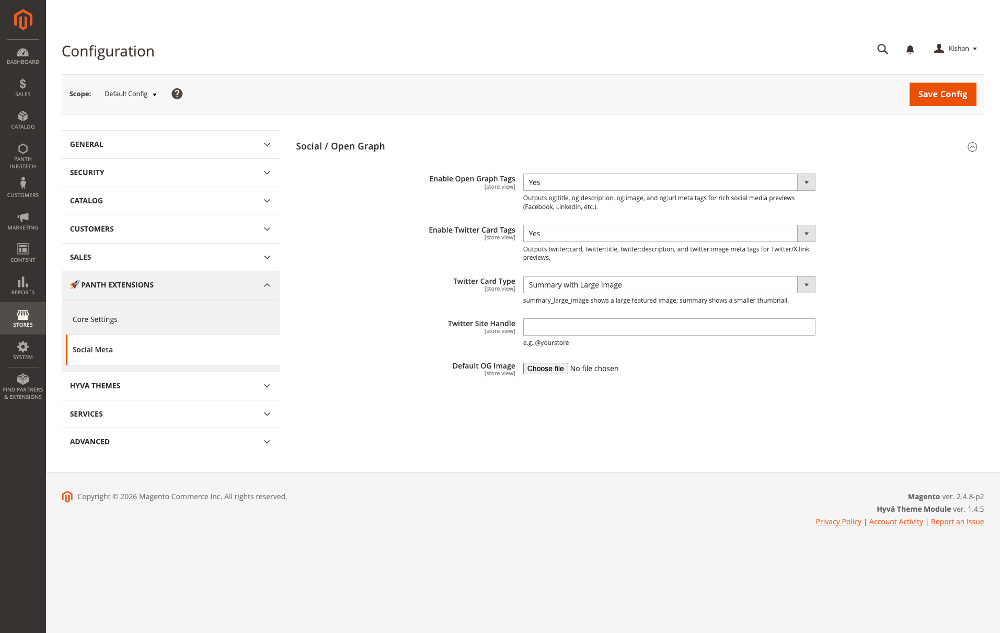

# Magento 2 Social Meta

Panth Social Meta adds Open Graph and Twitter Card meta tags to the `<head>` of every storefront page in Magento 2. On product pages it also emits `product:*` price, availability and brand tags, and on dated article pages (when a content module supplies the data) it emits `article:*` tags. The module removes Magento's native Open Graph blocks from the layout so only one set of `og:*` tags reaches the page.

It is aimed at merchants who share product, category and content pages on Facebook, LinkedIn, Twitter/X and similar platforms and want the preview title, description and image to be correct. The module ships two head blocks attached to `head.additional` through layout XML, with no JavaScript, so it works on both Hyva and Luma themes without template overrides.

Product page: [kishansavaliya.com/magento-2-social-meta.html](https://kishansavaliya.com/magento-2-social-meta.html)

## Features

- Emits `og:type`, `og:title`, `og:description`, `og:image`, `og:url`, `og:site_name` and `og:locale` on every storefront page.
- Product pages get `og:type=product` plus `product:price:amount` (the final price in the current store currency), `product:price:currency`, `product:availability` (`in stock` or `out of stock`, as defined by the Open Graph product specification) and `product:brand` (from the `manufacturer` attribute, omitted when empty).
- Category pages and all other pages (CMS pages, search, account, etc.) get `og:type=website`.
- Fallback chain for the title: product/category `og_title` attribute, then meta title, then entity name, then the page title set by the controller, then the store name.
- Fallback chain for the description: product/category `og_description` attribute, then meta description, then product short description, product description or category description, then the page description, then `design/head/default_description`. Descriptions are stripped of HTML (including `<style>` and `<script>` content), HTML entities are decoded, whitespace is collapsed and the text is truncated to 200 characters.
- Fallback chain for the image: product/category `og_image` attribute, product base image, category image, first enabled product image in the category, the configured Default OG Image, the store logo, then the base image placeholder configured under Stores > Configuration > Catalog > Catalog > Product Image Placeholders. When none of these is available `og:image` is omitted. The `og_image` attribute accepts an absolute `http(s)://` URL or a path relative to the media folder (for example `wysiwyg/share/shirt.jpg`). Category images stored as a site-relative path are converted to absolute URLs.
- `og:url` uses the product URL without the category path, the category URL, or the current URL elsewhere, with query string, fragment and trailing slash removed.
- `og:site_name` uses Stores > Configuration > General > Store Information > Store Name, falling back to the store view name.
- `og:locale` is the store view locale code (`general/locale/code`).
- Twitter Card tags `twitter:card`, `twitter:title`, `twitter:description` and `twitter:image` mirror the resolved Open Graph values; `twitter:site` is emitted only when a handle is configured.
- Open Graph and Twitter Card output can be switched on and off independently.
- Optional article tags: `article:published_time`, `article:modified_time`, `og:updated_time`, `article:author`, `article:section` and `og:type=article`, supplied through the `ArticleDataProviderInterface` extension point or a registry-based fallback.
- Observer on `layout_generate_blocks_after` removes Magento's native `opengraph.general`, `opengraph.product`, `opengraph.category` and `opengraph.cms` blocks, plus any block whose name contains `opengraph` or starts with `og.`.
- Data patch adds `og_title`, `og_description` and `og_image` attributes to all product and category attribute sets under the "Search Engine Optimization" group.
- URL-valued tags are escaped with `escapeUrl()`, text-valued tags with `escapeHtml()`, so handles such as `@yourstore` are readable in the page source.
- Both head blocks are declared `cacheable="true"`, so the output is stored in the full page cache with the rest of the page.

## Compatibility

| Platform | Versions |
|---|---|
| Magento Open Source | 2.4.4 to 2.4.8 |
| Adobe Commerce | 2.4.4 to 2.4.8 |
| PHP | 8.1, 8.2, 8.3, 8.4 |
| Themes | Hyva, Luma |

Composer constraints on Magento packages: `magento/framework ^103.0`, `magento/module-store ^101.1`, `magento/module-catalog ^104.0`, `magento/module-cms ^104.0`, `magento/module-config ^101.2`, `magento/module-eav ^102.1`.

## Requirements

- Magento Open Source or Adobe Commerce 2.4.4 to 2.4.8
- PHP 8.1, 8.2, 8.3 or 8.4 (`~8.1.0||~8.2.0||~8.3.0||~8.4.0`)
- `mage2kishan/module-core` `^1.0` (installed automatically by Composer; provides the "Panth Extensions" configuration tab)
- Magento modules `Magento_Catalog`, `Magento_Cms`, `Magento_Store`, `Magento_Config` and `Magento_Eav`, which are part of every standard installation

## Installation

```bash
composer require mage2kishan/module-social-meta
bin/magento module:enable Panth_Core Panth_SocialMeta
bin/magento setup:upgrade
bin/magento setup:di:compile
bin/magento cache:flush
```

`setup:di:compile` is only required in production mode. The module ships no static assets, so `setup:static-content:deploy` is not needed.

Check that the module is enabled:

```bash
bin/magento module:status Panth_SocialMeta
```

`setup:upgrade` runs two data patches: one adds the `og_title`, `og_description` and `og_image` product and category attributes, the other renames any configuration values saved under the legacy `panth_seo/social/*` paths to `panth_social_meta/social/*`.

## Configuration

Go to **Stores > Configuration > Panth Extensions > Social Meta**. All fields can be set at default, website and store view scope.



### Social / Open Graph

| Setting | Default | What it does |
|---|---|---|
| Enable Open Graph Tags | Yes | Outputs the `og:*` tags (and `product:*` tags on product pages). When set to No the module writes no `og:*` tags; the native Magento blocks are still removed. |
| Enable Twitter Card Tags | Yes | Outputs the `twitter:*` tags. Independent of the Open Graph toggle. |
| Twitter Card Type | Summary with Large Image | Value of `twitter:card`: `summary_large_image` (large image) or `summary` (small thumbnail). Any other stored value falls back to `summary_large_image`. |
| Twitter Site Handle | (empty) | Value of `twitter:site`, for example `@yourstore`. A leading `@` is added when missing. The tag is omitted when the field is empty. |
| Default OG Image | (empty) | Image uploaded to `media/panth_seo/og/`. Used as `og:image` and `twitter:image` when the page has no product, category or category-product image. |
| Enable Article Open Graph Tags | Yes | Emits `article:published_time`, `article:modified_time`, `og:updated_time` and `og:type=article` when an article data provider returns data. Has no effect when no provider is present. |
| Article Registry Fallback | No | Shown only when article tags are enabled. Reads the current entity from the Magento registry (keys `current_panth_blog_post`, `current_blog_post`, `current_post`) and calls `getPublishedAt()`, `getUpdatedAt()` and `getAuthorName()` if those methods exist. Leave off when a dedicated article data provider is installed. |

Configuration paths:

- `panth_social_meta/social/og_enabled`
- `panth_social_meta/social/twitter_enabled`
- `panth_social_meta/social/twitter_card_type`
- `panth_social_meta/social/twitter_site_handle`
- `panth_social_meta/social/default_og_image`
- `panth_social_meta/social/article_enabled`
- `panth_social_meta/social/article_registry_fallback`

With the default values the module emits Open Graph and Twitter Card tags on every page as soon as it is enabled; the only fields that usually need editing are the Twitter Site Handle and the Default OG Image. Flush the `config` and `full_page` caches after changing settings.

## Usage

The module works automatically on the storefront; there is nothing to place in the theme.

- On every page request the observer `Panth\SocialMeta\Observer\Social\RemoveNativeOgObserver` removes the native Open Graph blocks from the layout. This runs regardless of the module's configuration and writes a debug log entry for each removed block.
- `Panth\SocialMeta\Model\Social\OpenGraphResolver` detects the current product or category from the Magento registry and resolves the tag values described under Features. `Panth\SocialMeta\Model\Social\TwitterCardResolver` reuses those values for the Twitter Card tags.
- The two templates render one `<meta>` element per resolved value and skip empty values. Tags are rendered inside `head.additional`.
- Article tags are added only when a provider returns data. Content modules can register a provider (see Developer Notes). If no provider is installed and the registry fallback is off, no `article:*` tags are emitted and `og:type` stays `product` or `website`.
- The module registers no cron jobs, console commands, admin pages, controllers or web API endpoints.

Templates that can be overridden in a theme:

- `Panth_SocialMeta::head/opengraph.phtml` (`view/frontend/templates/head/opengraph.phtml`)
- `Panth_SocialMeta::head/twittercard.phtml` (`view/frontend/templates/head/twittercard.phtml`)

Both templates call `$block->isEnabled()` and `$block->getTags()` and escape the output with `escapeUrl()` for URL-valued tags and `escapeHtml()` for everything else.

## Developer Notes

- Module name: `Panth_SocialMeta`
- Composer package: `mage2kishan/module-social-meta`
- Namespace: `Panth\SocialMeta`
- Module sequence: `Panth_Core`, `Magento_Catalog`, `Magento_Cms`
- ACL resource: `Panth_SocialMeta::config` (under `Magento_Config::config`), gating the configuration section
- Database tables: none. The module stores configuration in `core_config_data` and installs EAV attributes only.
- Layout: `view/frontend/layout/default.xml` adds the blocks `panth_social_meta.opengraph` (`Panth\SocialMeta\Block\Head\OpenGraph`) and `panth_social_meta.twittercard` (`Panth\SocialMeta\Block\Head\TwitterCard`) to `head.additional`. Each block delegates to a view model, `Panth\SocialMeta\ViewModel\OpenGraph` or `Panth\SocialMeta\ViewModel\TwitterCard`, which expose `isEnabled(): bool` and `getTags(): array`.
- Resolvers: `Panth\SocialMeta\Model\Social\OpenGraphResolver::resolve(): array` and `Panth\SocialMeta\Model\Social\TwitterCardResolver::resolve(): array` return `property => content` maps with empty values removed. `OpenGraphResolver` receives `Magento\Framework\View\Page\Config` as a proxy (see `etc/di.xml`) to avoid a circular dependency during layout generation.
- Article extension point: implement `Panth\SocialMeta\Api\ArticleDataProviderInterface::getArticleData(): ?ArticleDataInterface` and add the class to the `providers` argument of `Panth\SocialMeta\Model\Social\Article\ArticleProviderPool` in your module's `di.xml`. Providers are queried in order and the first non-null result is used. `Panth\SocialMeta\Model\Social\Article\ArticleData` is the default implementation of `Panth\SocialMeta\Api\Data\ArticleDataInterface` (published time, modified time, author, section, tags, og type). Dates are normalised with `strtotime()` and output in ISO 8601 format. The `getTags()` values are not currently rendered.
- The registry fallback provider `Panth\SocialMeta\Model\Social\Article\RegistryArticleProvider` is registered under the key `registry_fallback`; its registry keys can be changed through the `registryKeys` argument in `di.xml`.
- Observer: `Panth\SocialMeta\Observer\Social\RemoveNativeOgObserver` on the frontend event `layout_generate_blocks_after`. Blocks whose name starts with `panth_social_meta.` are never removed.
- Data patches: `Panth\SocialMeta\Setup\Patch\Data\AddOgAttributes` and `Panth\SocialMeta\Setup\Patch\Data\MigrateConfigPaths`.
- The `og_title`, `og_description` and `og_image` attributes created by the data patch take priority over the other fields when they hold a value for the current store view; empty values fall through to the meta title, name, meta description, short description/description and image fields.
- Source model for the card type: `Panth\SocialMeta\Model\Config\Source\TwitterCardType`.

## Uninstallation

```bash
bin/magento module:disable Panth_SocialMeta
composer remove mage2kishan/module-social-meta
bin/magento setup:upgrade
bin/magento setup:di:compile
bin/magento cache:flush
```

Leave `Panth_Core` installed if other Panth extensions use it. The following data remains after removal and can be deleted manually if no longer needed: configuration rows under `panth_social_meta/social/*` in `core_config_data`, the `og_title`, `og_description` and `og_image` product and category attributes (with any values entered), and images uploaded to `pub/media/panth_seo/og/`. No database tables are created by the module.

## Support

- Product page: [kishansavaliya.com/magento-2-social-meta.html](https://kishansavaliya.com/magento-2-social-meta.html)
- Contact form: [kishansavaliya.com/contact](https://kishansavaliya.com/contact)
- Email: kishansavaliyakb@gmail.com
- Issues: [github.com/mage2sk/module-social-meta/issues](https://github.com/mage2sk/module-social-meta/issues)

## License

Proprietary, as declared in `composer.json`. The package is published on Packagist and can be installed with Composer; see the product page for the terms of use.

## Changelog

See [CHANGELOG.md](CHANGELOG.md).

## Links

- Website: [kishansavaliya.com](https://kishansavaliya.com)
- All extensions: [kishansavaliya.com/magento-extensions.html](https://kishansavaliya.com/magento-extensions.html)
- GitHub: [github.com/mage2sk/module-social-meta](https://github.com/mage2sk/module-social-meta)
- Packagist: [packagist.org/packages/mage2kishan/module-social-meta](https://packagist.org/packages/mage2kishan/module-social-meta)
